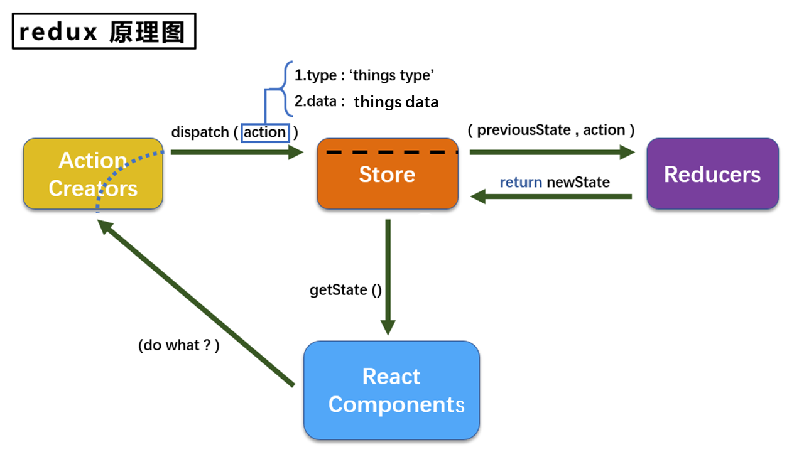

# redux 笔记

## 1. redux 文档

1. 英文文档: https://redux.js.org/
2. 中文文档: http://www.redux.org.cn/
3. Github: https://github.com/reactjs/redux

## 2. redux 理解

### 1. redux 是什么？

1. redux 是一个专门用于做状态管理的 JS 库（不是 react 插件库，也不是官方出品）。
2. 它可以用在 react, angular, vue 等项目中, **但基本与 react 配合使用**。
3. 作用: **集中式管理 react 应用中多个组件共享的状态。**

### 2. redux 什么时候用？

1. 某个组件的状态，需要让其他组件可以随时拿到时（即多个组件之间共享状态）。
2. 一个组件需要改变另一个组件的状态时（通信）。
3. **总体原则：能不用就不用, 如果不用比较吃力才考虑使用（因为有一定的学习成本）**

### 3. redux 工作流程图



1. React Components 相当于来餐厅吃饭的客人们；
2. Action Creators 相当于餐厅服务员们，可以有多个，负责统计客户的点的菜（1 个菜对应 1 个 action，action 就是普通的 js 对象，包含 type 和 data 属性）并通过 dispatch 方法将菜名上报给老板；
3. Store 相当于餐厅老板，只有 1 个！负责接收服务员传递过来的菜名，并将每个客户的菜名分发给厨师们 Reducers 去做。
4. Reducers 相当于厨师，可以有多个，分别为不同客户的做菜，并将做好的菜交给老板。
5. 客户通过 getState 方法从老板那里拿到自己点的菜。

## 3. 求和案例——纯 react 实现

> 很简单，自己看代码。

## 4. 求和案例——react+redux 精简版

> 不包括 ActionCreators，action 对象由我们手动创建。

1. 下载 redux：`yarn add redux`

2. 在 src 文件夹下新建：
   
   - redux 文件夹
     
     - `store.js`
     
     - `count_reducer.js`

3. 在 store.js 文件中：
   . 引入 redux 中的 createStore 函数，该函数用于创建 1 个 store；
   . createStore(reducer)接收 1 个为其服务的 reducer（即餐厅老板开店之前需要聘用厨师）；
   . 将创建的 store 对象暴露出去。

4. 在 count_reducer.js 文件中：
   . reducer 有两个作用：初始化状态、加工状态；
   . reducer 本质是 1 个函数，接收 2 个参数：prevousState、action，并返回加工后的状态；
   . reducer 函数第 1 次调用时（组件状态初始化时），是 store 自动调用的，传递的 prevousState 是 undefined，action 中的 type 是`@@redux/INITx.x.x.x`，`x.x.x.x` 是随机生成的，没有传递 data。后面每当我们传递 action 对象，store 都会帮我们调用 reducer 函数来加工状态。
   . 将创建的 reducer 函数暴露出去；

5. redux 只负责集中管理组件的状态，不负责渲染页面，所以当组件通过 getState 方法拿到加工后的状态时，组件并不会在页面中重新渲染，这时需要我们在组件中手动监测 redux 中状态的变化：

```jsx
  // Count组件的index.jsx
  componentDidMount(){
    // subscribe方法用于监测redux状态的变化；
    // 回调函数会在store中的状态改变时自动调用；
    store.subscribe(() => {
      this.setState({});
    });
  }
```

也可以直接在项目的 index.js 文件中监测 redux：

```js
// index.js
ReactDOM.render(<App />, document.getElementById("root"));
store.subscribe(() => {
  ReactDOM.render(<App />, document.getElementById("root"));
});
```

6. 在组件的 index.jsx 文件中：
- 引入 store 对象；
- 将组件本来的 state 去掉；
- 通过 store.getState()获取加工后的状态；
- 通过 store.dispatch(action)向 store 发送 action 对象。

## 5. 求和案例——react+redux 完整版

- 在 redux 文件中新建：
  - count_action.js 即 ActionCreators 部分，用来生成 action 对象。
  - constant.js 用于管理常量，保存 action 对象的 type 属性的值

## 6. redux 的异步 action

- **同步 action**：js 中的普通对象；

- **异步 action**：函数；

- store 只会将普通对象交给 reducer 进行加工，所以如果是异步 action，**需要依赖 redux-thunk 中间件**，通过中间件告诉 store 传入的是异步 action，让 store 帮我们调用这个函数，而在这个函数内部执行异步任务（通过定时器或者发送 ajax 请求，将同步 action 给 reducer 进行加工）

- **异步 action 不是必须的，完全可以在组件自身中通过定时器或发送 ajax 请求到达异步 action 的效果。**

- 中间件用法：
  
  - 在 store.js 文件中引入 _redux-thunk_。
    
    ```jsx
    // 引入applyMiddleware函数
    import { createStore, applyMiddleware } from "redux";
    // 引入redux-thunk模块（中间件）
    import thunk from "redux-thunk";
    import CountReducer from "./count-reducer.js";
    // 使用中间件
    export default createStore(CountReducer, applyMiddleware(thunk));
    ```
  
  - 创建异步 action：
    
    ```jsx
    // count_action.js
    export const createIncreAsyncAction = (data, delayTime) => {
    // 通过redux-thunk中间件，store会帮我们调用返回的函数，并将store.dispatch函数作为参数传入，所以就不需要引入store.js文件了
    return (dispatch) => {
      // 使用定时器发送同步action，从而实现异步action
      setTimeout(() => {
        dispatch(createIncreAction(data));
      }, delayTime);
    };
    };
    ```

## 7.  react-redux

### 1. 介绍

- react-redux 是 facebook 官方出品，功能和 redux 一样，但是它是专门为 react 服务的，用法比 redux 更复杂；
- 它将 react 组件分为 **容器组件** 和 **UI 组件**，它们是父子关系。
- **容器组件由 react-redux 中的 connect 函数创建**；UI组件由我们自己创建。
- 用法：
  1. 下载：`yarn add react-redux`
  2. 在 src 文件夹下新建 *containers\Count\index.jsx* 文件，在该文件中引入 react-redux 和 Count 的 UI 组件，通**过 react-redux 提供的 connect 函数，将容器组件与 UI 组件建立联系**；
  3. 在 App.jsx 中取消引入 UI 组件，而引入容器组件和 store 对象，**并将 store 对象作为容器组件的 props 属性，而不是在容器组件中直接引入 store 对象!!**。

### 2. 原理图


### 3. 基本使用

容器组件围绕 connect 函数展开工作：

1. 给 connect 函数传入两个参数：**mapStateToProps函数**、**mapDispatchToProps函数**（**或对象**）；
   
   - mapStateToProps 函数**负责将 redux 中的状态传递给 UI 组件**；
     
     - 接收 1 个参数，**该参数就是 store.getState() 得到的值**（由 react-redux 帮我们调用）
     
     - 返回 1 个对象，也必须是对象！**该对象的 key 就映射为 UI 组件的 props 属性的 key，该对象的 value 就映射为 UI 组件的 props 属性的 value**；
     
     - 函数的名字是 react-redux 提供的，也可以取其他名字。
   
   - mapDispatchToProps 函数**负责将 redux 中操作状态的方法传递给 UI 组件**；
     
     - 接收 1 个参数，**该参数就是 store.dispatch 函数**；
     
     - 返回 1 个对象，也必须是对象！**该对象的 key 会被映射为 UI 组件的 props 属性的 key，该对象的 value 会被映射会 UI 组件的 props 属性的 value**；
     
     - 函数的名字是 react-redux 提供的，也可以取其他名字。
   
   - 如果 mapDispatchToProps 是对象，则应该这么写：
     
     ```jsx
     //只需要将创建action的函数作为value，react-redux 就会自动调用dispatch
     //方法将action分发出去（在底层API上做了优化），个人绝对这么写不好理解。
     const mapDispatchToProps = {
       increment: createIncreAction,
       decrement: createDecreAction,
       incrementAsync: createIncreAsyncAction,
     }
     ```

2. 分别实现 mapStateToProps 函数和 mapDispatchToProps 函数或对象。

3. 使用了 react-redux 就不需要再使用 store.subscribe(()=>{}) 来监测 redux 的状态是否改变了，因为react-redux实现了父组件与子组件通信（**父组件给子组件传递props，只要props属性发送变化，就会重新渲染子组件**）

### 4. 求和案例中 react-redux 优化

1. 容器组件和UI组件写在一个文件中。如：`containers/Count/index.jsx`

2. 无需自己给每个容器组件都传入 store 对象，用`<Provider store={store}></Provider>`包裹`<App/>` 组件即可，App 组件中的所有容器组件都能接收到 store 对象。
   
   ```jsx
   // index.js
   import {Provider} from 'react-redux';
   import store from './redux/store';
   ReactDOM.render(
       <Provider store={store}>
           <App/>
       </Provider>,
       document.getElementById("root")
   );
   ```

3. 使用 react-redux 后，不需要自己去监测 redux 中状态的改变了，容器组件可以帮助我们完成这个工作。

4. mapDispatchToProps 也可以是个对象。

5. 一个组件要和 redux 通信，要经过哪几步？
   
   1. 先定义好UI组件，不向外暴露。
   
   2. 引入 connect 函数，传入UI组件，生成一个容器组件，向外暴露。
   
   3. 在UI组件中通过`this.props.xxx` 读取和操作 redux 中的状态。

### 5. 完成两个组件之间数据的共享

1. 下载 nanoid 库：`yarn add nanoid`，用于生成用户的 id

2. 编写 Person 组件的 `reducers/person.js` 和 `actions/person.js` 。

3. 在 `store.js` 文件中引入 **combineReducers 函数（接收1个对象）**，将 Person 组件的 reducer 和 Count组件的 reducer 作为参数对象的属性传入。
   
   ```jsx
   import {combineReducers} from 'redux';
   // 现在redux管理的是combineReducers函数的参数对象
   const allReducers = combineReducers({
       count: CountReducer,
       persons: PersonReducer
   });
   export default createStore(allReducers, applyMiddleware(thunk));
   ```

4. 修改 `containers/Count/index.jsx` 中的 mapStateToProps 和 mapDispatchToProps 函数。
   
   ```jsx
   // 此时接收的state是redux管理的状态对象（即combineReducers函数的参数）。
   // state包含Count组件和Person组件的状态，所以可以将Person组件的状态
   // 作为 Count的UI组件的props属性，实现两个组件的状态的共享
   const mapStateToProps = (state) => ({count: state.count,persons: state.persons});
   const mapDispatchToProps = (dispatch) => {
     return {
       increment: (value) => {dispatch(createIncreAction(value))},
       decrement: (value) => {dispatch(createDecreAction(value))},
       incrementAsync: (value, delayTime) => {dispatch(createIncreAsyncAction(value,delayTime))}
     }
   }
   ```

5. **注意：redux 中的 reducer 函数必须是一个纯函数**。
   
   ```jsx
   const initialState = [{id: '1', name: 'www', age: 18}];
   export default function PersonReducer(prevState=initialState,action){
     const {type,data} = action;
     switch (type) {
       case ADD_PERSON:
         //错误
         //preState.unshift(data);
         //return preState;
         //返回一个新数组
         return [...prevState,data];    
       default:
         return prevState;
     }
   }
   ```
   
   >        通过push、unshift方法向preState中添加内容，这样只是改变了原数组preState的内容，其在内存中的地址并没有变，**react-redux 会使用 diff 算法比较返回值与 preState 在内存中的地址是否一致，如果不一致则会更新 状态**；如果一致，则不改变状态，所以这就是使用unshift、push等方法不会有效果的原因。
   > 
   >         正如 redux 原理图中所示，reducer 必须返回一个新state，这个新是相对于preState来讲的，它们的地址不应该是相同的。

### 6. react-redux 开发者工具

1. 在 chrome 应用商店下载插件：`Redux DevTools` 插件。

2. 在项目中下载：`yarn add redux-devtools-extension`

3. 在 `store.js` 文件中进行包的配置，否则在页面上不能使用这个插件。
   
   ```jsx
   import {composeWithDevTools} from 'redux-devtools-extension';
   // 注意包的用法
   const store = createStore(allReducers, composeWithDevTools(applyMiddleware(thunk)));
   export default store;
   ```

4. 使用截图
   
   

## 8. 纯函数

1. 纯函数是一类特别的函数：**<u>多次调用同一个函数，传入相同的参数，必定得到相同的输出</u>**。

2. 纯函数必须遵守的一些约束：
   
   - **不得改写参数**。即不能在函数内部改变参数的值。
   
   - **函数体不能产生任何副作用**。即不能在函数内部做网络请求、连接输入输出设备等（因为做网络请求不一定会成功）
   
   - **不能在函数内部调用`Date.now()` 或 `Math.random()` 等产生的值具有随机性的方法**。

3. redux 中的 reducer 函数必须是一个纯函数。
   
   ```js
   // 非纯函数举例：
   function fn1(a){
      //每次调用fn1(1)，都会得到不同的返回值
      return a + Math.random()
   }
   // 调用fn2(1)，函数内部改变了参数a的值
   function fn2(a){
       a = {name: 'www'}
       return a;
   }
   ```

## 9. 项目打包

1. `yarn build` 打包项目，会在项目目录下生成一个`build`文件夹。

2. 将打包好的文件部署到云服务器上，需要下载 `serve`包：`npm i -g serve`（我已全局安装，不知道为什么用 yarn 全局安装包不起作用）

3. 在项目目录下，输入`serve -s build` 或  `serve build`  启动云服务器。

4. 启动成功后，打开相应url，浏览器中的 react 开发者工具插件会亮。
